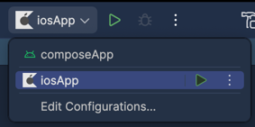
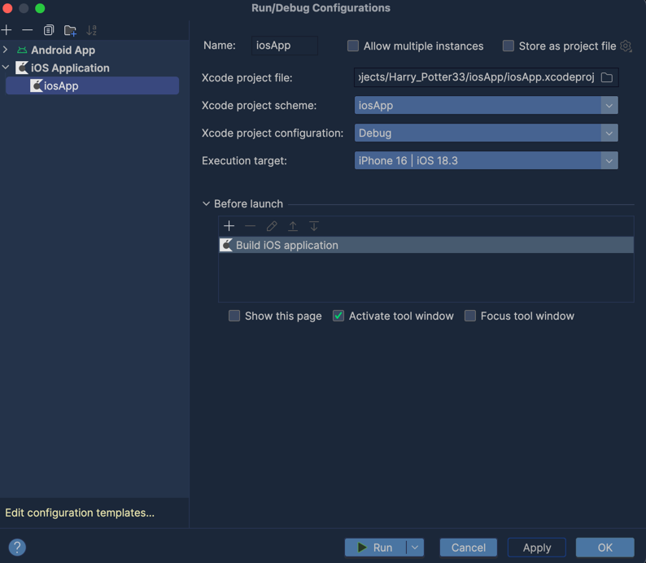

# Before run project install following tools:
### 1. Install Android Studio and Xcode

### 2. Install Homebrew
```Bash
echo 'export PATH="/opt/homebrew/bin:$PATH"' >> ~/.zshrc
source ~/.zshrc
brew --version
```

### 3.Install Kdoctor
```Bash
brew install kdoctor
```
### 4. Check what do you need to install
```Bash
kdoctor
```

### 5. Install Ruby
```Bash
brew install ruby
echo 'export PATH="/opt/homebrew/opt/ruby/bin:$PATH"' >> ~/.zshrc
source ~/.zshrc
```

### 6. Install Cocoapods
```Bash
sudo gem install cocoapods
```

### 7. Add dependencies
```Bash
nano ~/.zshrc
```
At the end of your file add:
```Bash
export PATH="/opt/homebrew/lib/ruby/gems/3.4.0/bin:$PATH"
```

```Bash
nano ~/.zprofile
```
At the end of your file add:
```Bash
export LANG=en_US.UTF-8
export LC_ALL=en_US.UTF-8
```

### Check if everything is set
```Bash
source ~/.zprofile
```
```Bash
source ~/.zshrc
```

## If you don't see green play in iosApp like here


Run this command in your computer's terminal 
```Bash
xcodebuild -downloadPlatform iOS -exportPath ~/Downloads -buildVersion 18.2
```
Then you'll be able to choose Execution target and run our project on IOS


## Now you are ready to run our project 😊